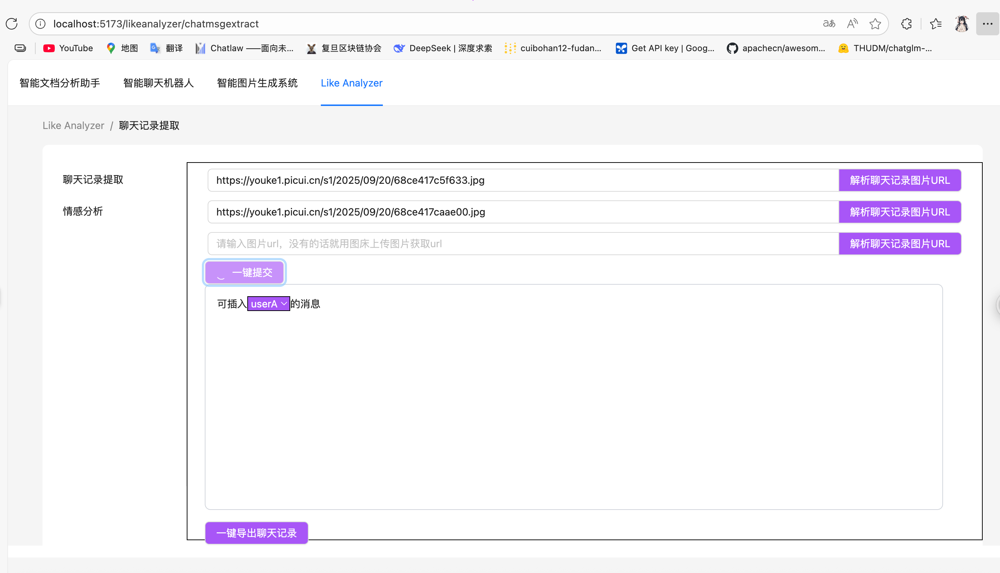
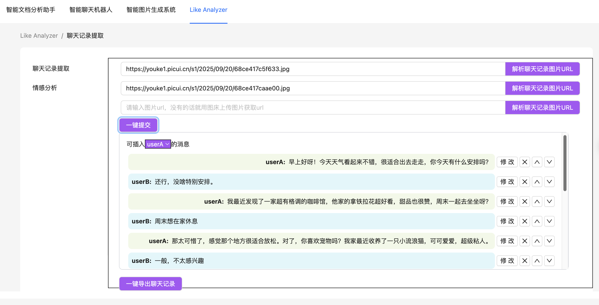
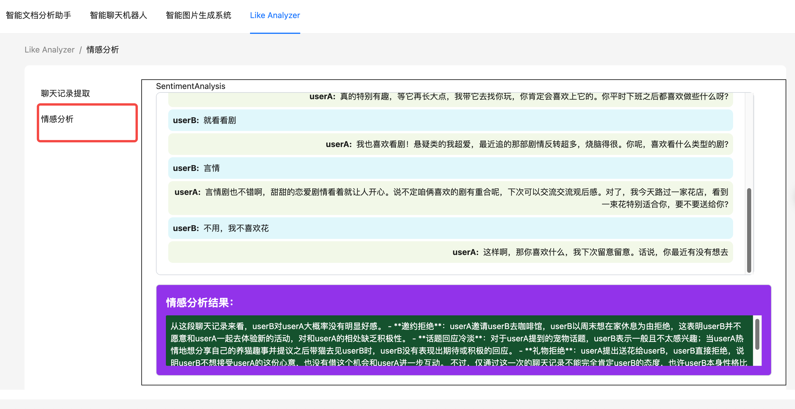
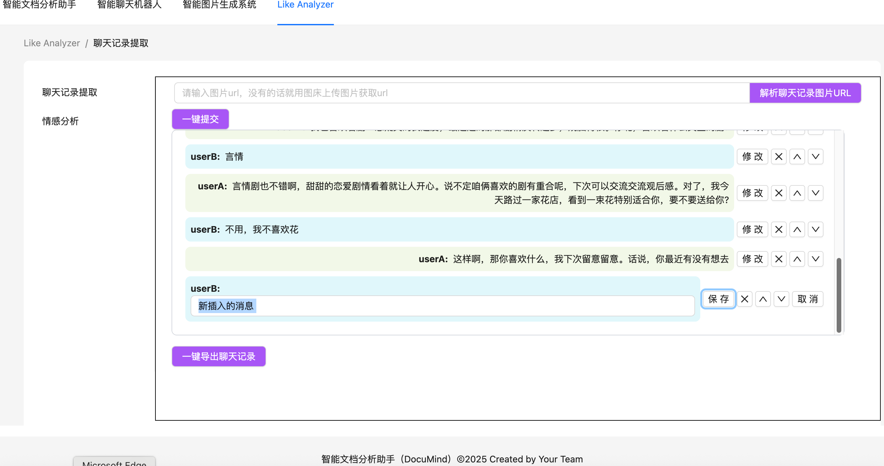
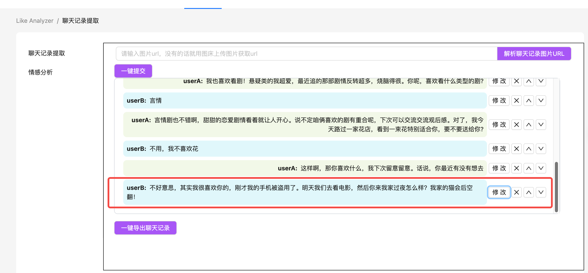
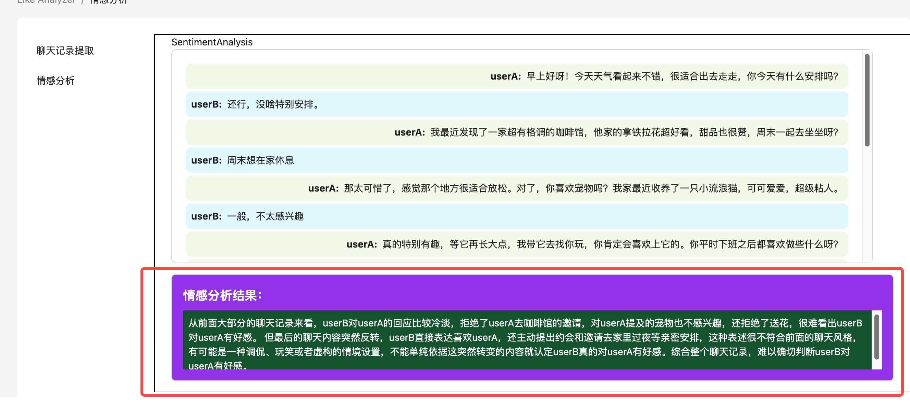
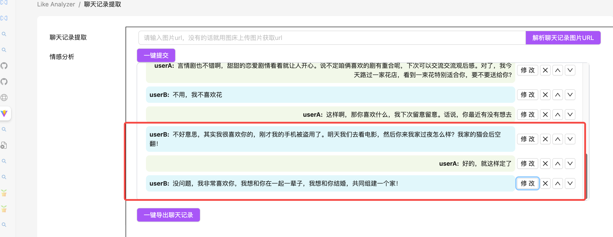
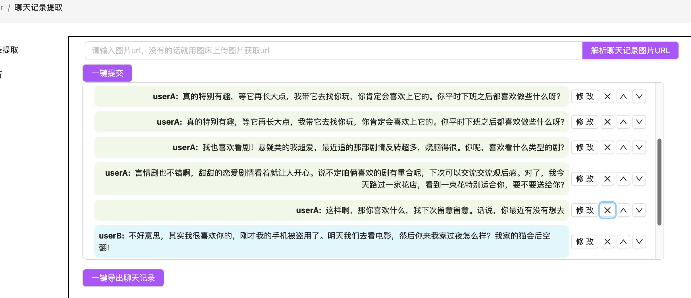

<<<<<<< HEAD

# 一个好玩的项目

功能：对微信聊天记录图片（图床url）提取聊天记录，并且进行情感分析，让AI判断对方是否对自己有好感




上传后可以提取图片信息，效果如下



情感分析



提取完图片信息直接点击这里，就可以了



可以对消息进行编辑，插入（双方的都可以）



再次情感分析





这次试试删除前面消极的记录



# 部署方法

在火山引擎官网上获取API key，给main.py的VOLENE_API_KEY变量赋值

准备好nodejs环境

```
npm i
```

```
npm run dev
```

就可以启动成功

只能把图片传到图床用url

# React + Vite

This template provides a minimal setup to get React working in Vite with HMR and some ESLint rules.

Currently, two official plugins are available:

- [@vitejs/plugin-react](https://github.com/vitejs/vite-plugin-react/blob/main/packages/plugin-react/README.md) uses [Babel](https://babeljs.io/) for Fast Refresh
- [@vitejs/plugin-react-swc](https://github.com/vitejs/vite-plugin-react-swc) uses [SWC](https://swc.rs/) for Fast Refresh

## Expanding the ESLint configuration

If you are developing a production application, we recommend using TypeScript and enable type-aware lint rules. Check out the [TS template](https://github.com/vitejs/vite/tree/main/packages/create-vite/template-react-ts) to integrate TypeScript and [`typescript-eslint`](https://typescript-eslint.io) in your project.
=======================================================================================================================================================================================

# DocuMind

项目名称：智能文档分析助手（DocuMind）  核心功能：  1. 多格式文档解析与知识库构建（PDF/DOCX/TXT） 2. 基于文档内容的智能问答系统 3. AI辅助内容生成（摘要/改写/续写） 4. 对话式文档分析界面 5. 模型微调管理平台

>>>>>>> 5c74cd9d5afaff6aa81533ececf9d5db6286d177
>>>>>>>
>>>>>>
>>>>>
>>>>
>>>
>>
